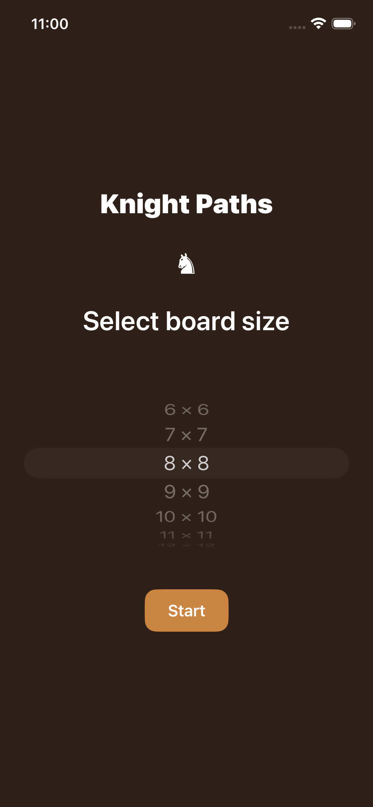
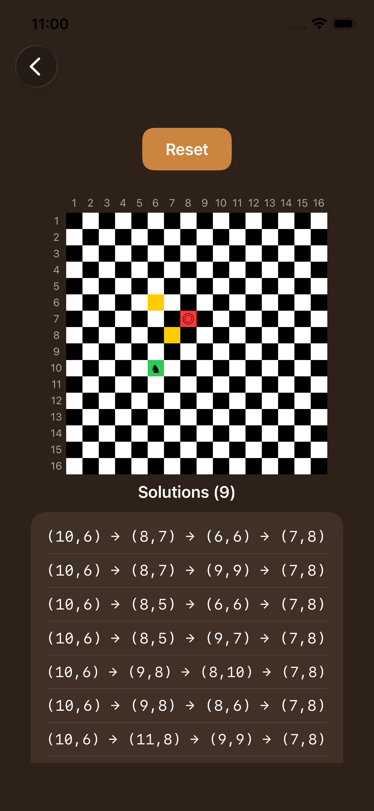
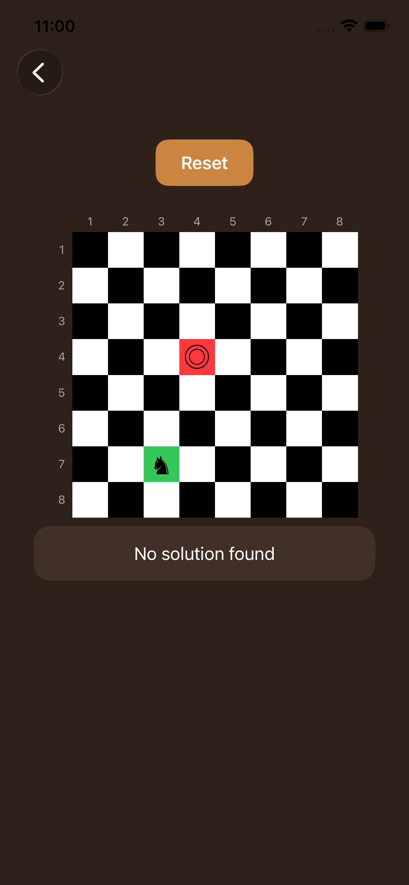

# KnightPaths

An iOS app that, given an NxN chessboard (6 ≤ N ≤ 16), finds **all paths a knight can take from a start square to an end square in exactly 3 moves**, and renders them.

Built with SwiftUI, MVVM, and a pure, fully testable solver.

---
## How to run

1. Open `KnightPaths.xcodeproj` in **Xcode 26+** (iOS 26 deployment target, Swift 5).
2. Select an iPhone simulator and press **Run** (⌘R).
3. Pick a board size (6–16) and tap **Start**.
4. Tap one square to set the **start** (green ♞), tap another to set the **end** (red ◎). All 3-move solutions are listed below the board.
5. Tap a solution to highlight its squares on the board. Tap **Reset** to start over.

If no path exists, the app shows **"No solution found"**.

---
## 📸 Screenshots


<p align="center">
  
  
  
</p>

---

## Architecture

The project follows MVVM with a clean separation between game logic and UI. The solver has **zero UI dependencies**, which is what makes it unit-testable.

```
KnightPaths/
├── App/          → app entry point
├── Models/       → Square, Knight, Board   (pure value types)
├── Services/     → KnightSolver            (pure path-finding logic)
├── ViewModels/   → BoardViewModel          (state + user intent)
├── Views/        → SizeSelectionView, BoardView
└── Theme/        → colors and button style
```

- **`Square`** – a board coordinate (`row`, `col`), `Equatable`/`Hashable`, with a `moved(byRow:byCol:)` helper.
- **`Knight`** – the 8 relative knight moves as static data.
- **`Board`** – knows its size and whether a square is inside it.
- **`KnightSolver`** – the core: given a `Board`, returns all 3-move paths between two squares.
- **`BoardViewModel`** – `ObservableObject` holding `start`, `end`, the computed `paths`, and the currently highlighted path.

---

## Algorithm

The solver expands paths **breadth-first, exactly 3 levels deep**, then keeps only the paths that land on the end square:

1. Start with the single path `[start]`.
2. Three times, extend every current path by every legal knight move that stays on the board.
3. After 3 expansions, filter the paths whose last square equals `end`.

Each square has at most 8 knight moves, so the search space is bounded by **8³ = 512 paths** regardless of board size — trivial to compute even for 16×16 (verified at well under 1 ms).

```swift
func paths(from start: Square, to end: Square) -> [[Square]] {
    var paths: [[Square]] = [[start]]
    for _ in 1...3 {
        paths = paths.flatMap { path in
            nextSquares(from: path.last!).map { path + [$0] }
        }
    }
    return paths.filter { $0.last == end }
}
```

> A knight changes square colour on every move. After 3 moves (an odd number) it always lands on the **opposite** colour from where it started. So if `start` and `end` are the **same colour**, no 3-move path can exist — the solver correctly returns an empty result, and the UI shows "No solution found."

---

## Testing

Unit tests live in `KnightPathsTests` (Swift Testing framework) and cover:

- **Happy path** – a known solvable case returns the expected paths.
- **No solution (parity)** – same-colour start/end squares always return an empty result.

---

## With more time

- Render the moves in **algebraic chess notation** (a1, b3, …) and animate the knight along a selected path.
- Make the move count a parameter (`maxMoves`) instead of a hard-coded 3, so the solver generalises.
- Add a guard so the start and end can't be the same square in the UI.

---

## 👤 Author

Built by **Dimitris Polyzos** — iOS Developer
[github.com/dimitrispolyzos99](https://github.com/dimitrispolyzos99)
---

